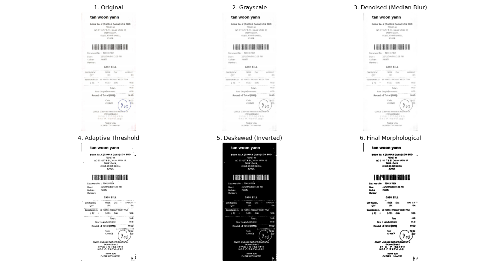

# Tesseract OCR Preprocessing Pipeline

This repository contains an advanced image preprocessing pipeline designed to optimize scanned documents and noisy images for Tesseract OCR.

## Pipeline Overview

The pipeline executes a highly robust 6-step sequence to eliminate noise, handle irregular shadows, correct skew, and perfectly preserve thin text:

1. **Grayscale Conversion**: Converts the image to a single channel.
2. **NLMeans Denoising**: Uses a gentle `fastNlMeansDenoising` pass (`h=3`) to remove background speckles without destroying thin text details.
3. **Adaptive Thresholding**: Utilizes Gaussian adaptive thresholding to cleanly binarize the image, perfectly handling shadows and uneven lighting (unlike global Otsu).
4. **Hough Transform Deskewing**: Uses Canny Edge Detection and `HoughLinesP` to find horizontal text lines. It then calculates the angle of the widest line to perfectly deskew rotated documents.
5. **Morphological Opening**: Applies a `2x2` rectangular kernel to remove isolated background noise specks.
6. **Dilation & Blob Filtering**: Uses a `3x3` rectangular kernel to expand the text (making it bolder and more filled), followed by Connected Component Analysis (Blob Filtering) to mathematically eradicate any remaining noise blobs under 10 pixels in area.

## Visualization

The sequence of these 6 steps can be visualized perfectly below on an extreme synthetic test image with 4% salt-and-pepper noise, uneven lighting, and a 5-degree rotation:



## Usage

You can run the full pipeline and visualize the steps by running:
```bash
python src/visualize_steps.py
```
